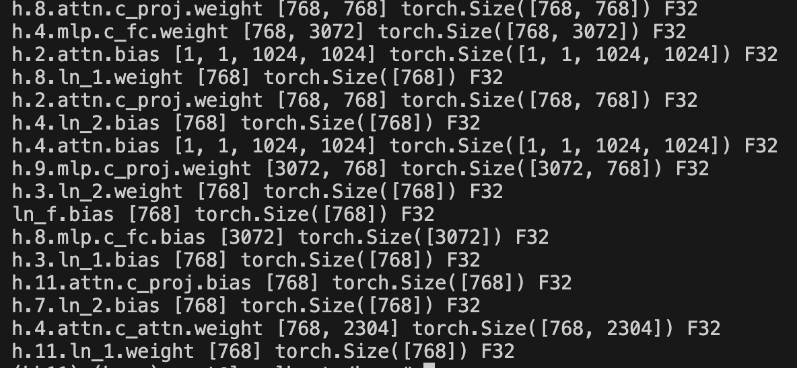

#### Dataset?

- Dataset is found in `../../assets/tiny.txt`
- We need to make a utility functions that:-
    - (1) loads `tiny.txt` and using the `gpt2` tokenizer, write a snippet that can `encode` and `decode` the raw-text
    - (2) loads the `model.safetensors` file found at location
     "https://huggingface.co/openai-community/gpt2" and work on this. Can you find a way to verify this?


#### On `tiny.txt` file

The following utility solves the problem
```python
def encode_decode_file(filename):
    f = open(filename, "r")

    # need to make it know the encoding method name. Why?
    # Once, we load weights, we need to specify the enc mech
    # So, that we can go to and from between encode and decode
    enc = tiktoken.encoding_for_model("gpt2")

    tokens = enc.encode( f.read() )
    print( tokens[:3] ) # tokenised as numbers

    tokens_dec = enc.decode( tokens ) # list -> string
    print( tokens_dec[:3] ) # Works!
    return
```


#### On `model.safetensors`

- Locate and find a view of all the components of the model on HF <Files info>
    - 
    > [!NOTE]
    > - The files_info part has all the info about the model architecture and relates to file `model.safetensors`
    - Click on this. We can check the model's tensors' `dtype` , `shape` and other info.
    - Can use this to load `safetensors` also called `weights` and verify
    - Wer writre a utility that:-
        - Reads this `model.safetensors` file in binary format
        - Meaning of each component as we load and print in `terminal`
        - Build a map of `tensor_name` and its corresponding `weight`


##### Working with safetensor and verifying on HF

###### Load safetensor and check content
```python
    fp = open(path, "rb") # Trap

    # deserialize this using safetensor pkg
    safetensor = safetensors.deserialize(fp.read())

    # read and verify the safetnsor
    print( type(safetensor) ) # <class 'list'>
    print( safetensor[0] )
```
- The `safetensor[0]` returns the following tuple

- `h.1.mlp.c_proj.bias` can be verified on `hf` with the same name and `shape` as below image

- Given that we know this, can we make a datastructure that stores these byte form of weights in torch.tensor types as a dict?


- Solution
```python
def read_safetensor(path):
    fp = open(path, "rb") # Trap

    # deserialize this using safetensor pkg
    x = safetensors.deserialize(fp.read())

    # read and verify the safetnsor
    print( type(x) ) # <class 'list'>
    # print( x[0] ) # ("tensor_name", "actual_data_byte_format")

    params = dict()
    for safetensor in x:
        name = safetensor[0]
        shape = safetensor[1]["shape"]
        data = safetensor[1]["data"]
        dtype = safetensor[1]["dtype"]

        # convert
        tensor = torch.frombuffer(buffer=data, dtype=torch.float32)
        # returns 1D tensor
        tensor = tensor.reshape(shape)
        # print( name, shape, tensor.shape, dtype )

        params[name] = tensor
    return params
```

Intermediate output of `print( name, shape, tensor.shape, dtype )`, makes it clear, we read the data correctly.

