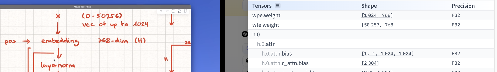

#### Embedding is the first operation (Related to `unembedding layer i.e last layer; Hence weight-tying`)
> [!NOTE]
> - While working with learning map of emb => nn.Embedding()
> - Working with fixed weights F.linear() and F.embedding()
> - (seq_len) -> Get weight_embs for each  of these input tokens search in emb_dict
> - No need to transpose, it automatically does that


##### Where to find on HF and viz

- wpe.weight: positional weights which are frozen after training (for indices 0... 1023)
- wte.weight: Tensor(input) weights which are frozen after training (for token_indices 0... seq_len-1)


##### Observations for following weight-tying question

```funda
- params["wte.weight"]: [vocab_size, d_model]

- F.embedding: gets vector from token index (lookup row)

- F.linear: computes dot of input with all vocab rows (weight.T)

- Weight tying means we reuse the same matrix for both
```

``` Mental Diagram
Embedding: token_id → vector
  token_id = 12
     |
     v
  Lookup row 12 from wte.weight
     |
     v
  word_vec = wte.weight[12]   # shape = (768,)

Unembedding: vector → logits
  word_vec (shape = 768,)
     |
     v
  dot with all rows of wte.weight.T (i.e. F.linear)
     |
     v
  logits over 50257 vocab entries

```

``` python
F.embedding(input=token_ids, weight=params["wte.weight"])
# token_ids → [0, 12, 233, ...] ← index into vocab
# Output: word vectors of shape [seq_len, d_model]
output[i] = params["wte.weight"][token_ids[i]]
# → You just look up rows in the matrix — like a word lookup table.
```


```python
# Let hidden_state = [64, 768]
# and params["wte.weight"] = [50257, 768]

# Then, F.linear() will transpose the weight and do:

F.linear(input=hidden_state, weight=params["wte.weight"])

# output = hidden_state @ params["wte.weight"].T

# hidden_state: [64, 768]

# weight.T: [768, 50257]

# Output: [64, 50257] ← scores for each vocab token (logits)

# Each row of output is a distribution over vocabulary, typically followed by F.softmax
```


##### Code Snippets and Funda

```python
    # No need to transpose, it automatically does that
    wte_out = F.embedding( input=x, \ # Ensure, input is torch.tensor
                           weight = params["wte.weight"], # No need to transpose
                            ) # implicitly funda: searches tokens position in dict and transforms
```

```python
def get_input_and_pe(x, params):
    # x: (seq_len, d_model) -> (64, 768)

    # NOTE: While working with learning map of emb => nn.Embedding()
    # Working with fixed weights F.linear() and F.embedding()
    # (seq_len) -> Get weight_embs for each  of these input tokens search in emb_dict
    # No need to transpose, it automatically does that
    wte_out = F.embedding( input=x, \
                           weight = params["wte.weight"],
                            )
    print( wte_out.shape ) # torch.Size([64, 768])


    # positional encoding -> wpe.weight is frozen repr of positions from [0, 1023]
    # each 0, 1, 2, .., 1023 indices is in 768 dim
    # need to first know seq_len of input
    seq_len = x.shape[0]
    pos_input = torch.arange(seq_len)
    # print(pos_input)
    # (seq_len) -> Get pos_embs for each  of these input tokens search in emb_dict
    wpe_out = F.embedding( input = pos_input, 
                          weight= params["wpe.weight"] )
    print( wpe_out.shape )

    embedding_out = wte_out + wpe_out
    return embedding_out
```


> - [!NOTE]
> - embedding vs unembedding comparision
```python
    # x: (seq_len, d_model) -> (64, 768)

    # NOTE: While working with learning map of emb => nn.Embedding()
    # Working with fixed weights F.linear() and F.embedding()
    # (seq_len) -> Get weight_embs for each  of these input tokens search in emb_dict
    # No need to transpose, it automatically does that
    wte_out = F.embedding( input=x, \
                           weight = params["wte.weight"],
                            )
    print( "wte_out Shape: ", wte_out.shape ) # torch.Size([64, 768])


    # positional encoding -> wpe.weight...
```


```python
    # unembedding (weight-tying) : we use the same F.embedding layer to get back to vocab_space
    # (seq_len, d_model) @ (d_model, vocab_size) -> (seq_len, vocab_size)
    # [seq_id = 0] => [ x1 x2 .... x50256 ] => xi's are logits, max logit value is pred
    y_pred = F.linear( input= ln_f_out, 
              weight = params["wte.weight"] )
    print( "y_pred Shape: ", y_pred.shape ) # torch.Size([64, 50257])
```